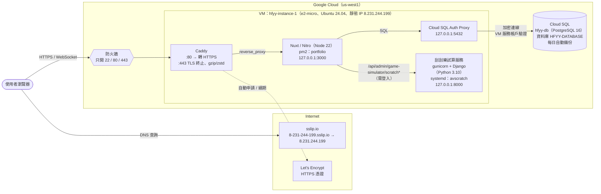
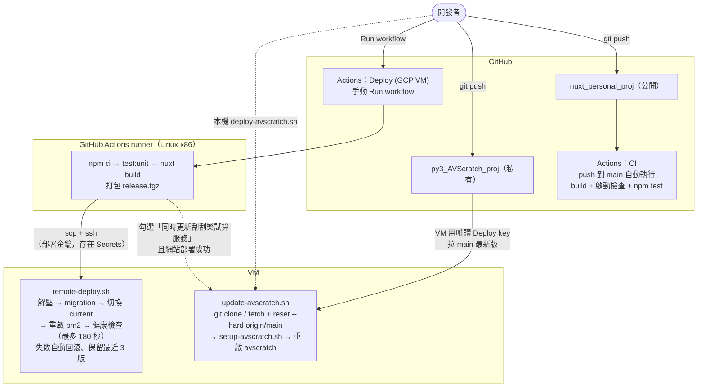
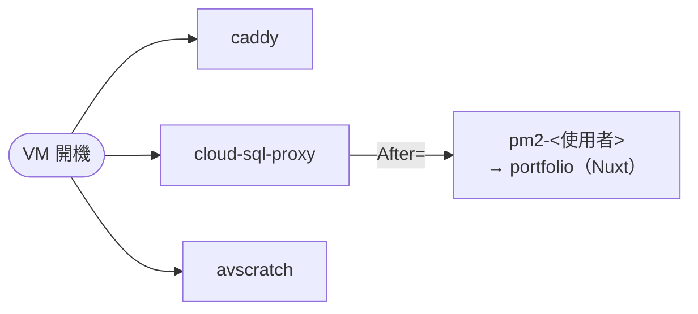
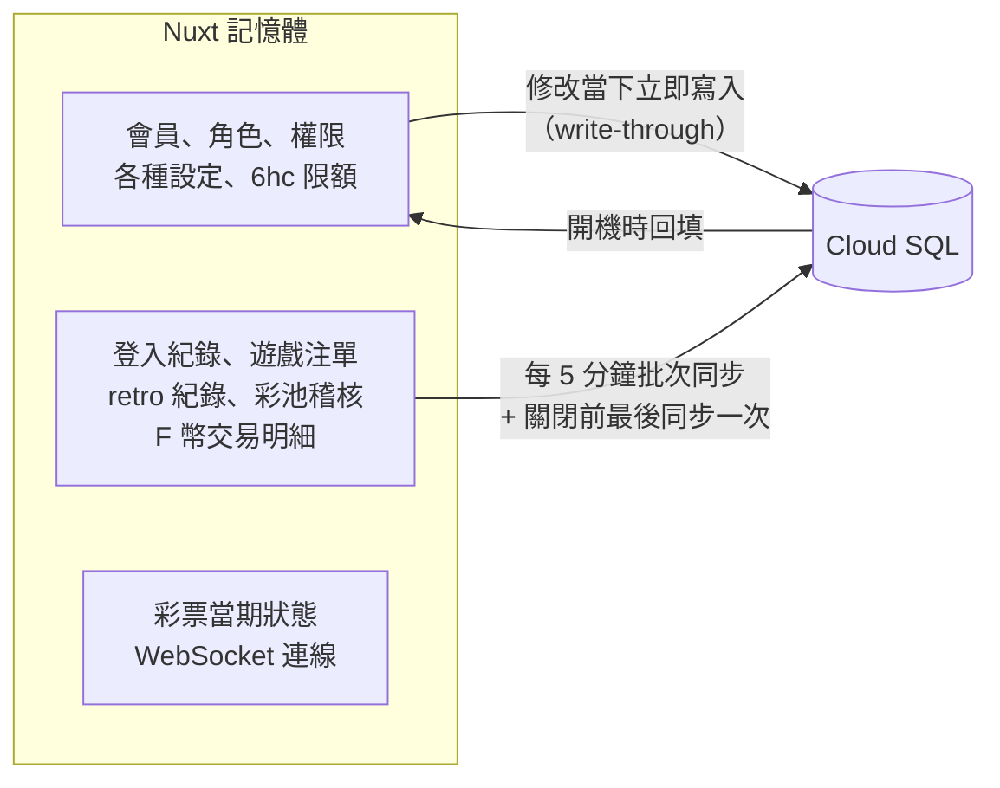

# 部署架構

線上 Demo 的完整部署架構：執行時的服務組成、部署流程、開機順序與資料流向。

- 網址：**https://8-231-244-199.sslip.io**
- 建置步驟：[gcp-vm.md](gcp-vm.md)
- 資料庫上線檢查：[postgres-production-checklist.md](postgres-production-checklist.md)

> 本文件只記錄架構與公開資訊。密碼、金鑰、GCP 專案 ID、服務帳戶等機密不寫在 repo 內。

---

## 1. 執行架構



| 元件 | 監聽 | 管理方式 | 對外 |
|---|---|---|---|
| Caddy | `:80`、`:443` | systemd `caddy` | ✅ 唯一對外入口 |
| Nuxt / Nitro | `127.0.0.1:3000` | pm2 `portfolio`（systemd `pm2-<使用者>`） | ✗ |
| Cloud SQL Auth Proxy | `127.0.0.1:5432` | systemd `cloud-sql-proxy` | ✗ |
| 刮刮樂試算服務 | `127.0.0.1:8000` | systemd `avscratch` | ✗ |
| Cloud SQL | 公開 IP（不設授權網路） | GCP 代管 | ✗ 只接受 Auth Proxy |

### 設計重點

- **只有 Caddy 對外**：其餘服務都只綁 `127.0.0.1`。GCP 防火牆也只開 22 / 80 / 443。
- **一定要 HTTPS**：production 的登入 cookie 帶 `secure`，純 HTTP 無法登入。Caddy 自動處理憑證，WebSocket（聊天室）不需額外設定。
- **Nuxt 只跑 1 個 process**：開獎排程、WebSocket 連線與部分狀態在記憶體中，多個 process 會不一致。
- **Cloud SQL 經 Auth Proxy 連線**：以 VM 服務帳戶驗證、連線自動加密，不需要開放資料庫 IP 白名單，也不用在 VM 放金鑰檔。VM 的存取權範圍必須是 `cloud-platform`。
- **刮刮樂試算服務只能經由 Nuxt 存取**：Django 設定為 `DEBUG=True`，不能對外；Nuxt 的代理 API 需要登入。

---

## 2. 部署流程

兩個 repo 分開部署，也可以在網站部署時一起更新試算服務。



| 部署對象 | 觸發方式 | 來源 |
|---|---|---|
| 網站 | GitHub Actions「Deploy (GCP VM)」→ Run workflow | runner 上 build 的產物 |
| 刮刮樂試算服務 | 同上並勾選「同時更新刮刮樂試算服務」，或本機 `VM=... bash deploy/gcp-vm/avscratch/deploy-avscratch.sh` | VM 直接從 GitHub 拉 `main` |

- **網站不在 VM 上 build**：e2-micro 只有 1GB 記憶體，`nuxt build` 容易記憶體不足。
- **push 不會自動部署**：都需要手動觸發，避免每次 push 都更新線上版本。
- **試算服務部署的是 GitHub `main`**：本機未 push 的 commit 不會上線。
- **網站部署失敗**：自動回滾到上一版，且不會接著更新試算服務。

### 網站的版本目錄

```
/srv/portfolio/
├─ releases/
│  ├─ 20261008065615-fixboot/
│  ├─ 20261008071904-96d3fdd/
│  └─ 20261008091903-e4d5a18/   ← 保留最近 3 版，舊的自動刪除
├─ current → releases/<目前版本>   切換版本 = 換 symlink
└─ shared/.env                     環境變數與密碼（權限 600，不隨部署覆蓋）
```

### 試算服務目錄

```
/srv/avscratch/
├─ app/    py3_AVScratch_proj 的 git clone + packages/ 內的 Linux 套件 + db.sqlite3
└─ venv/   uv 建立的 Python 3.10 虛擬環境
```

Python 必須是 3.10、Pillow 必須是 9.5：程式碼使用 `ImageDraw.textsize()`，Pillow 10 已移除，而 Pillow 9.5 不支援 Ubuntu 24.04 內建的 Python 3.12。

---

## 3. 開機順序

VM 開機或重開機後，所有服務都會自動啟動，不需要手動處理。



- pm2 用 systemd drop-in（`/etc/systemd/system/pm2-<使用者>.service.d/cloud-sql-proxy.conf`）排在 Auth Proxy 之後啟動。如果網站比 Proxy 先啟動，會因為連不到資料庫而退回純記憶體模式。
- 實測：Proxy 先啟動，6 秒後 pm2 啟動，網站連上 Cloud SQL。

---

## 4. 資料流向與保存



| 資料 | 寫入時機 | 重啟 / 部署後 |
|---|---|---|
| 會員、角色、權限、設定 | 修改當下 | 保留 |
| 登入紀錄、注單、交易明細等 | 每 5 分鐘 + 關閉前 | 保留（程序被強制終止、當機或斷電時，可能遺失最近 5 分鐘） |
| 彩票當期狀態、WebSocket 連線 | 不寫入 | 重置 |

- **關閉前同步**：Nitro 收到 `SIGTERM` / `SIGINT` 時呼叫 `close` hook 執行最後一次同步。pm2 的 `kill_timeout` 設為 15 秒，讓同步有時間完成。
- **第一次接上空資料庫**：開機要寫入種子帳號與 NPC，e2-micro 實測約 3 分鐘完成初始化；之後從資料庫回填，約 30 秒。
- **備份**：Cloud SQL 每日自動備份，保留 7 份。

---

## 5. 機密與金鑰的位置

| 項目 | 存放位置 | 用途 |
|---|---|---|
| 管理員種子密碼、`DATABASE_URL` | VM `/srv/portfolio/shared/.env`（權限 600） | 網站啟動 |
| 網站部署 SSH 私鑰、VM host key | GitHub repo Secrets（`GCP_VM_*`） | Actions 連線到 VM |
| 部署金鑰的公鑰 | VM `~/.ssh/authorized_keys`（註解 `github-actions-deploy`） | 允許 Actions 登入 |
| 試算服務 GitHub 唯讀金鑰 | VM `~/.ssh/avscratch_deploy`；公鑰在 `py3_AVScratch_proj` 的 Deploy keys | VM 從私有 repo 拉程式碼 |
| Cloud SQL 存取 | VM 服務帳戶（Cloud SQL Client 角色）+ 存取權範圍 `cloud-platform` | Auth Proxy 驗證，不使用金鑰檔 |

撤銷存取：

- **GitHub Actions 登入 VM**：刪除 VM `~/.ssh/authorized_keys` 中 `github-actions-deploy` 那一行。
- **VM 讀取 `py3_AVScratch_proj`**：GitHub repo → Settings → Deploy keys，刪除該金鑰。

---

## 6. GCP 資源與每月費用

| 資源 | 規格 | 每月約 |
|---|---|---|
| VM | e2-micro、us-west1-b | US$0（免費額度） |
| 開機磁碟 | 平衡永久磁碟 30GB | US$3 |
| 靜態外部 IP | 1 個 | US$3.6 |
| Cloud SQL | Enterprise、共用核心 1 vCPU / 0.614GB、HDD 10GB、單一可用區、無 HA | US$8.6 |
| 網路流量 | 作品集流量 | 約 US$0 |
| **合計** | | **約 US$15** |

以 [GCP 價格計算機](https://cloud.google.com/products/calculator) 與實際帳單為準。

---

## 7. VM 資源用量（2026-10-08 實測）

| 項目 | 用量 |
|---|---|
| 記憶體 | 總共 953MB；Nuxt 約 130MB、試算服務約 150MB（上限 400MB）；另有 1GB swap |
| 磁碟 | 根目錄 29G，已用約 6.5G |

---

## 8. 版本

| 元件 | 版本 |
|---|---|
| Ubuntu | 24.04 LTS |
| Node.js | 22.x（CI / build 用 22.22.2） |
| Caddy | 2.11 |
| Cloud SQL Auth Proxy | 2.26.0 |
| PostgreSQL | 16 |
| Python（試算服務） | 3.10（uv 管理） |
| Django / Pillow / numpy | 5.2.6 / 9.5.0 / 1.26.0 |
